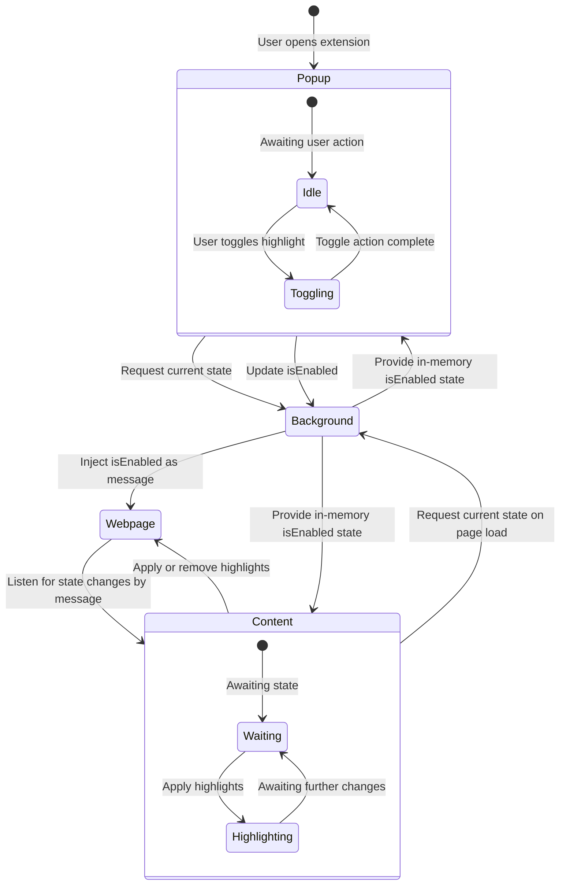

# Stretch: Persisting State

## Problem Update

This time, we are concerned about this working accross tabs and page reloads. The headings on all open tabs must be highlghted and the highlighting toggle state must be persistent when leaving the extension popup, changing tabs, refreshing the page and opening new pages.

> [!TIP]
> Since we are now concerned with state management, we will need a [background service worker](https://docs.plasmo.com/framework/background-service-worker) to hold the toggle state in-memory and communicate between popup.tsx and our content script. For this, we will also need to use [plasmo's messaginging API](https://docs.plasmo.com/framework/messaging).

## Getting Set Up

### **1. Project Folder Set Up**

1. If you want a recommended folder structure, see section `Recommended Folder Structure`, otherwise design your own structure.

2. Update files and folders for your solution inside `src`.

### **3. Get Coding!** 🚀

## Recommended Folder Structure

The folder structure used for this exercise is as follows:

```bash
src/
├── background/
│   └── messages/
│       └── toggleState.ts
├── features/
│   └── toggle.tsx
├── content.ts
├── popup.tsx
└── style.tsx
```

The `utils` fodler has been deprecated as we are now targeting all tabs and this can be handled by our **background script**.

> [!NOTE]
> This is not the only way to solve this problem, but for plasmo to work you will need as a minimum `popup.tsx` in the `src` folder, a background service worker for messaging in the `background/messages/` folder and either `content.ts` in the `src` folder or a `contents` folder with code files that interact with the webpages' DOM elements.

## Run Solution

If you want to run this solution to see what it should look like, follow these steps:

### **1. Clone Repo**

In your work directory, run this command to clone the repo and go into the local repo folder:

```sh
git clone https://github.com/TandemCreativeDev/fac-ws_extensions_heading-highlighter.git
cd fac-ws_extensions_heading-highlighter
```

### **2. Change Branch**

Checkout the branch for this exercise by running:

```sh
git checkout stretch
```

### **3. Install Dependencies**

Ensure you have **Node.js** and **pnpm** installed. Then, install Plasmo dependencies:

```sh
pnpm install
```

The following step can be used in your project aswell to test changes you make in the code dynamically:

### **4. Run in Development Mode**

You can run the extension in **development mode** to test it live:

```sh
pnpm dev
```

Then, open Chrome and go to:

```
chrome://extensions/
```

- Enable **Developer Mode** (toggle in the top-right corner).
- Click **Load Unpacked** and select the `chrome-mv3-dev` in your project's `build` folder.

---

## Building & Installing for Production

To create a production-ready version of the extension:

```sh
pnpm build
```

This will generate a `build` folder. To install it in Chrome:

1. Open `chrome://extensions/`
2. Enable **Developer Mode**.
3. Click **Load Unpacked**.
4. Select the `chrome-mv3-prod` in your project's `build` folder.

> [!WARNING]
> FOR LINUX USERS\
> When running `pnpm dev` or `pnpm build` in a Linux environment you may come accross dumping errors or errors related to a package called `sharp`. You may see an error such as:
>
> ```sh
>  ELIFECYCLE  Command failed with exit code 139.
> ```
>
> These seem to be caused by the latest `plasmo` dependencies under its tailwind configuration. Although such an error may pop up, the project has built and you can load it into Chrome as described above.

---

## How It Works

### **State Management Diagram**



### **Code File Explanations**

#### **Toggle Switch (`features/toggle.tsx`)**

- Implements a **Tailwind-styled** toggle switch **React** component.
- Uses `peer` class-based styling for visual state changes.

#### **Popup (`popup.tsx`)**

- Implements a **Tailwind-styled** popup menu **React** component, rendering **toggle switch** interaction and current highlighting state state (ON or OFF).
- Manages the toggle switch state (`isEnabled`).
- Requests the current state from the **background script** using `sendToBackground()`.
- Updates the state when toggled and sends the new value to the **background script**.

#### **Background Script (`background/messages/toggleState.ts`)**

- Stores the `isEnabled` state **in memory** (resets when the extension reloads).
- Responds to state requests from the **popup** and **content script** via `sendToBackground()`.
- Notifies all open tabs of state changes by **injecting `window.postMessage()`** via `chrome.scripting.executeScript()`.

#### **Content Script (`content.ts`)**

- Runs on **all webpages** (`<all_urls>`).
- On **page load**, requests the current `isEnabled` state from the **background script**.
- Listens for **`TOGGLE_HIGHLIGHTS`** messages via `window.postMessage()`.
- Dynamically updates heading background colors based on the received state.

---
